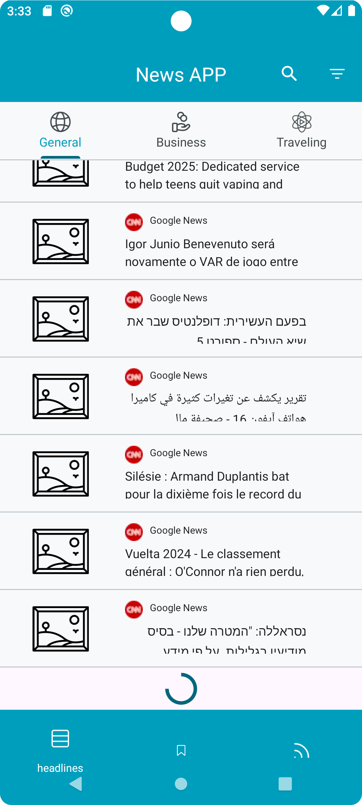
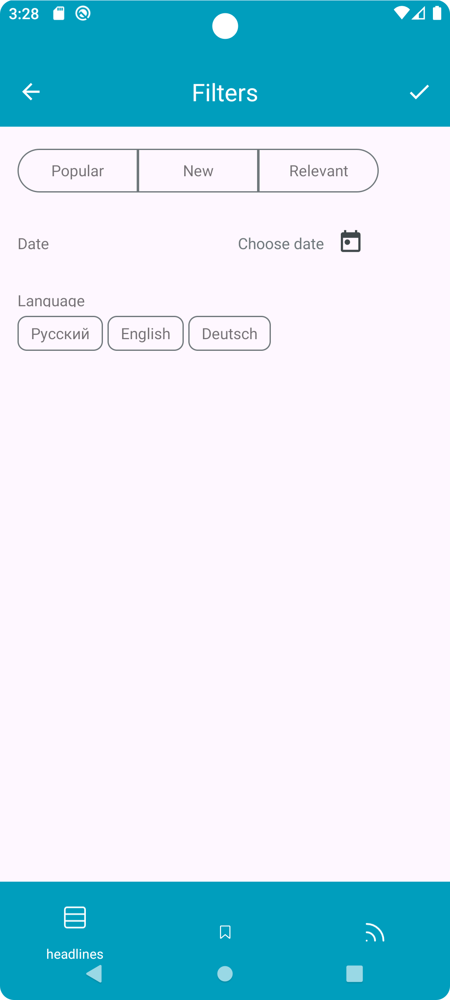
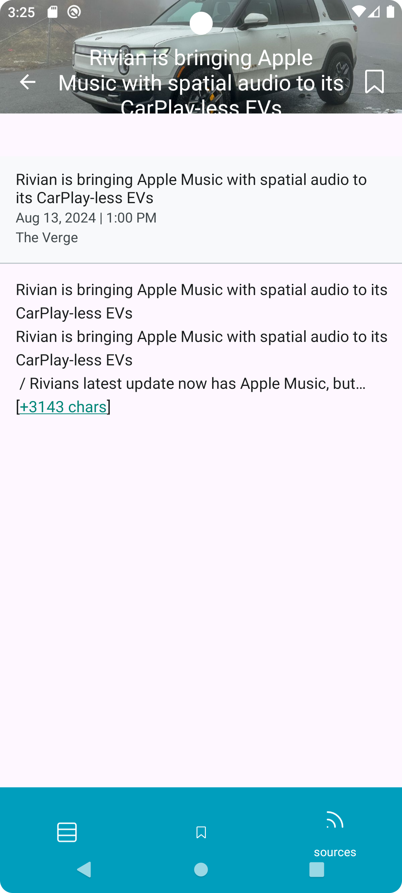

Приложение WorldNewsInfo для просмора новостей на разных языках со всего мира.

Состоит из 3 основных вкладок: headlines(новости по тематике), saved(сохраненные на телефоне) и sources(новостные каналы) .

|При запуске приложения проигрывается заставочное видио, пока приложение не загрузится.||
|-|-|

|На вкладке headlines можно просмотивать новости по разным тематикам(общие, спорт, туризм и др.). Так же присутствует поиск, фильтрация и погинация(добовление новых новостей при пролистывании).||||
|-|-|-|-|

|На вкладке saved можно просмотреть ранее сохраненные страницы.||
|-|-|

|На вкладке sources можно посмотреть все новостные каналы, чьи новости использует приложение. При нажатии на канал открывается список новостей канала.||||
|-|-|-|-|

|На любой вкладке при нажатии на новость открывается страница с полной информацией новости. При нажатии флажка новость сохраняется на телефон, при повторном нажатии удаляется.|||
|-|-|-|
